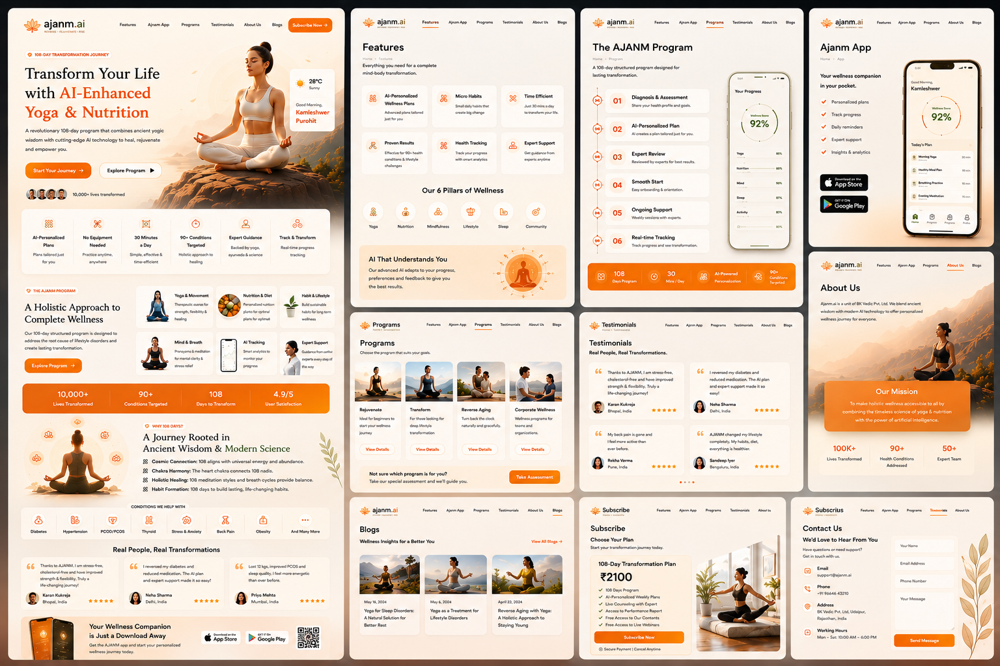
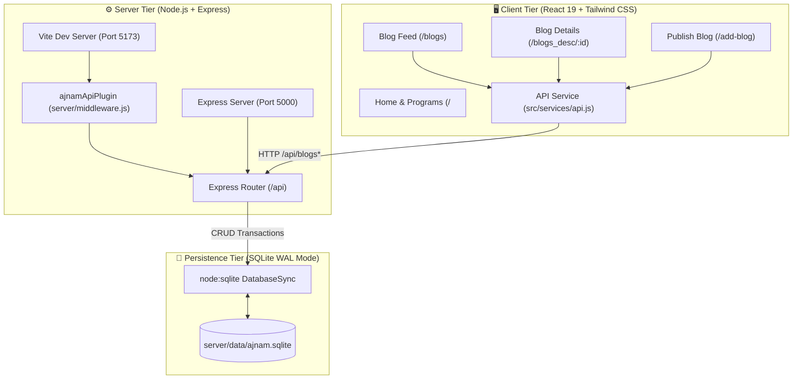
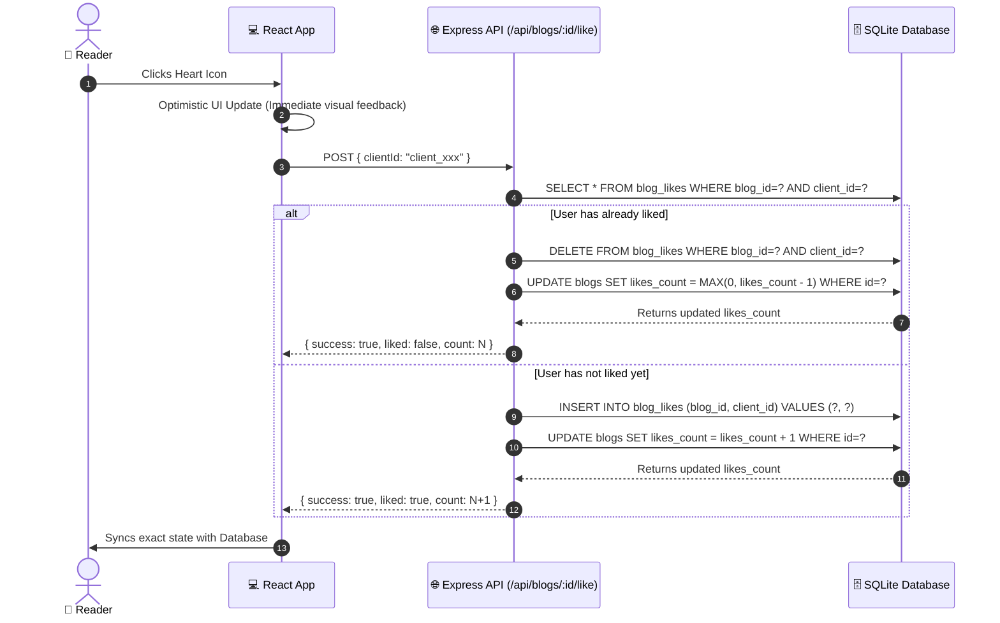
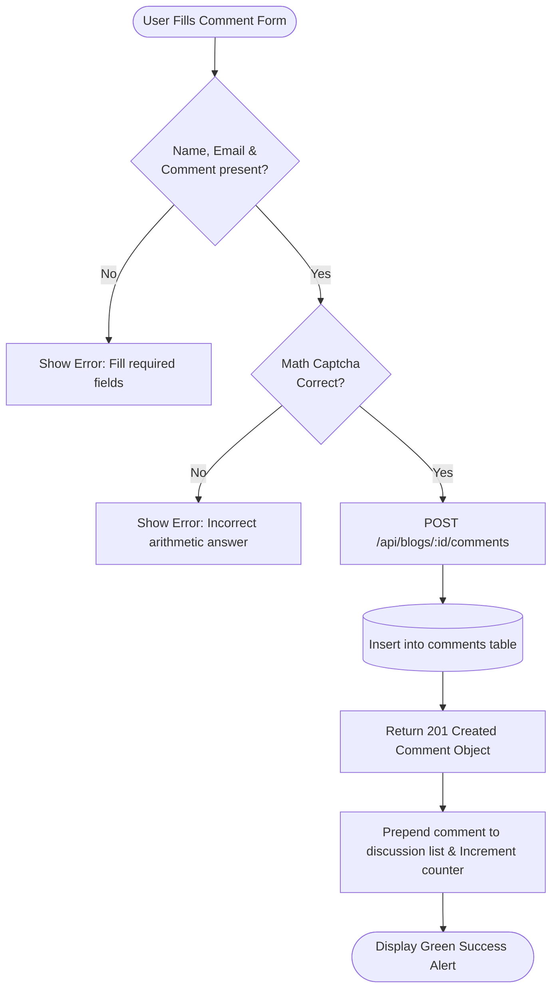
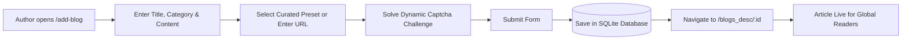
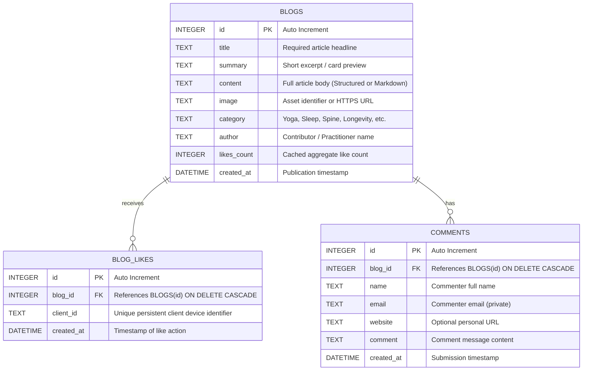

# 🧘 AJANM — Holistic Yoga & Wellness Platform

<div align="center">



[](https://react.dev/)
[](https://vitejs.dev/)
[](https://tailwindcss.com/)
[](https://expressjs.com/)
[](https://www.sqlite.org/)
[](LICENSE)

**Empowering balanced living through authentic Yogic wisdom, lifestyle therapy, and real-time community engagement.**

[Explore Features](#-key-features) • [System Architecture](#-system-architecture) • [ER Diagram](#-entity-relationship-er-diagram) • [API Reference](#-api-endpoints) • [Quickstart](#-getting-started)

</div>

---

## 📖 Table of Contents

- [Overview](#-overview)
- [Key Features](#-key-features)
- [System Architecture](#-system-architecture)
- [Workflows & System Logic](#-workflows--system-logic)
- [Entity-Relationship (ER) Diagram](#-entity-relationship-er-diagram)
- [API Reference](#-api-reference)
- [Project Directory Structure](#-project-directory-structure)
- [Getting Started](#-getting-started)
- [Available Scripts](#-available-scripts)
- [Contributing](#-contributing)

---

## 🌿 Overview

**AJANM** is a modern full-stack web platform dedicated to holistic well-being, therapeutic yoga programs, and health transformation. It bridges traditional yogic wisdom with contemporary wellness practices, providing tailored programs for hormonal regulation, sleep enhancement, spinal care, and healthy aging.

The platform includes a real-time database-driven **Community & Insights Blog** enabling readers worldwide to discover wellness articles, interact via persistent likes, participate in community discussions, and contribute their own articles.

---

## ✨ Key Features

### 💖 Real Database Persistent Likes
- **Global Visibility**: Every like is stored and synced in a real SQLite database; like counts update in real-time across all visitors and devices.
- **Client Identity Tracking**: Uses persistent client identifiers to guarantee authentic, one-vote-per-user like/unlike toggling with instant optimistic UI feedback.

### 💬 Interactive Community Discussion & Comments
- **Real-Time Comment Threads**: Visitors can share personal stories, questions, and insights.
- **Smart Captcha Protection**: Dynamic arithmetic captcha prevents automated spam submissions.
- **Memory Convenience**: Option to securely store commenter name and email in local storage for seamless subsequent replies.
- **Rich Display**: Shows custom commenter avatars, formatted dates, and website hyperlinks.

### ✍️ Community Blog Authoring (`/add-blog`)
- **Self-Service Publishing**: Users and wellness practitioners can compose and publish new articles directly to the database.
- **Curated Asset Presets**: Quick-select presets for Hormones, Sleep, Lifestyle, Aging, Spine, Meditation, Pranayama, and Nutrition, or provide a custom image URL.
- **One-Click Template**: Pre-formatted guide template to help authors structure introductions, health connections, asana routines, and conclusions.

### 📱 Responsive & Accessible UI
- Designed with brand identity tokens (`#e67e22` primary theme, warm typography, and smooth card elevations).
- Fully responsive across mobile, tablet, laptop, and ultra-wide displays.

---

## 🏛 System Architecture

The application adopts a unified full-stack architecture where Vite's development server integrates an Express API middleware, connecting directly to Node.js's native SQLite database engine.



---

## 🔄 Workflows & System Logic

### 1. Like Toggle Workflow



---

### 2. Comment Posting & Validation Workflow



---

### 3. Article Authoring & Publishing Workflow



---

## 🗄️ Entity-Relationship (ER) Diagram

The relational model stores blogs, user likes, and comments with cascading foreign-key integrity.



---

## 📡 API Reference

All endpoints are served under `/api` and return standardized JSON responses: `{ success: true, data: ... }`.

| Method | Endpoint | Query / Body Parameters | Description |
| :--- | :--- | :--- | :--- |
| `GET` | `/api/blogs` | `?clientId=<id>` *(optional)* | Retrieve all articles, including total likes, comment counts, and client liked status. |
| `GET` | `/api/blogs/:id` | `?clientId=<id>` *(optional)* | Retrieve a single article with content, metadata, like status, and pagination IDs. |
| `POST` | `/api/blogs` | `{ title, summary, content, category, author, image }` | Publish a new wellness article to the database. |
| `POST` | `/api/blogs/:id/like` | `{ clientId: "<id>" }` | Atomically toggle like / unlike status for a visitor. |
| `GET` | `/api/blogs/:id/comments` | *None* | Fetch all comments for an article sorted in descending order (newest first). |
| `POST` | `/api/blogs/:id/comments` | `{ name, email, website, comment }` | Submit a new comment to an article. |

---

## 📁 Project Directory Structure

```text
Ajnam/
├── public/                     # Public static assets & favicon
│   ├── Ajnam.png               # Main project banner
│   ├── logo.png                # Ajanm brand logo
│   └── _redirects              # SPA hosting redirect rules
├── server/                     # Backend API & Database
│   ├── data/                   # SQLite database directory (gitignored)
│   │   └── ajnam.sqlite        # Persistent database file
│   ├── api.js                  # Express API routes (/api/blogs*)
│   ├── db.js                   # SQLite schema, queries & initial seed data
│   ├── middleware.js           # Vite dev-server connect middleware plugin
│   └── server.js               # Standalone production Express server
├── src/
│   ├── assets/                 # Wellness illustrations & blog images
│   │   ├── blogs-image/        # Seed blog cover images
│   │   └── images/             # UI icons, branding & program graphics
│   ├── components/             # Reusable UI & Page components
│   │   ├── Aboutus.jsx         # About us view
│   │   ├── AddBlog.jsx         # New article authoring page
│   │   ├── AjanmApp.jsx        # Mobile app promotional section
│   │   ├── AjanmProgram.jsx    # Holistic programs list
│   │   ├── Blogs.css           # Blog & community styling
│   │   ├── Blogs.jsx           # Real-time blogs grid & like toggles
│   │   ├── Blogs_desc.jsx      # Article detail, likes & comment threads
│   │   ├── Feature.jsx         # Platform features
│   │   ├── Footer.jsx          # App footer
│   │   ├── Navbar.jsx          # Responsive header navigation
│   │   ├── Page.jsx            # Hero section
│   │   ├── Program.jsx         # Program cards
│   │   ├── Table.jsx           # Pricing & comparison table
│   │   └── Terms.jsx           # Terms & conditions
│   ├── services/
│   │   └── api.js              # Client API helper & persistent clientId manager
│   ├── App.css                 # Global CSS overrides
│   ├── App.jsx                 # Route definitions & router setup
│   ├── index.css               # Tailwind CSS imports & CSS variables
│   └── main.jsx                # React root entry point
├── package.json                # Dependencies & script configurations
├── vite.config.js              # Vite configuration with API middleware
└── README.md                   # Project documentation
```

---

## 🚀 Getting Started

### Demo
- *https://ajanm.netlify.app/*

### Prerequisites
- **Node.js**: `v22.0.0` or higher *(recommended for native `node:sqlite`)*
- **npm**: `v10.0.0` or higher

### Installation

1. Clone the repository:
   ```bash
   git clone https://github.com/AkshitaGaur-hub/Ajanm.git
   cd Ajanm/Ajnam
   ```

2. Install dependencies:
   ```bash
   npm install
   ```

3. Launch the development environment:
   ```bash
   npm run dev
   ```
   *The Vite development server will automatically mount the backend API on `http://localhost:5173`.*

---

## 🛠️ Available Scripts

| Command | Action |
| :--- | :--- |
| `npm run dev` | Starts Vite dev server with integrated SQLite API middleware on `http://localhost:5173`. |
| `npm run build` | Compiles and optimizes frontend assets into `dist/`. |
| `npm run preview` | Previews the production build locally. |
| `npm run server` | Starts standalone Express API server on `http://localhost:5000`. |
| `npm run lint` | Lints JavaScript and JSX files using ESLint. |

---

## 🤝 Contributing

Contributions, issues, and feature requests are welcome!
Feel free to open an issue or submit a pull request to help make wellness accessible to everyone.

1. Fork the Project
2. Create your Feature Branch (`git checkout -b feature/AmazingFeature`)
3. Commit your Changes (`git commit -m 'Add some AmazingFeature'`)
4. Push to the Branch (`git push origin feature/AmazingFeature`)
5. Open a Pull Request

---

## 📄 License

Distributed under the MIT License. See `LICENSE` for more information.

<div align="center">
  <sub>Built with ❤️ for health, harmony, and mindfulness.</sub>
</div>
